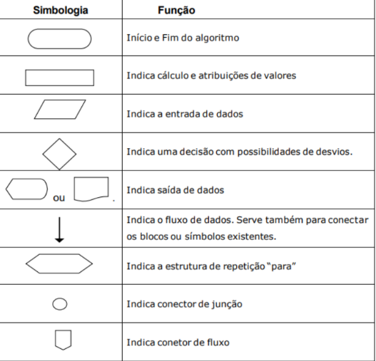
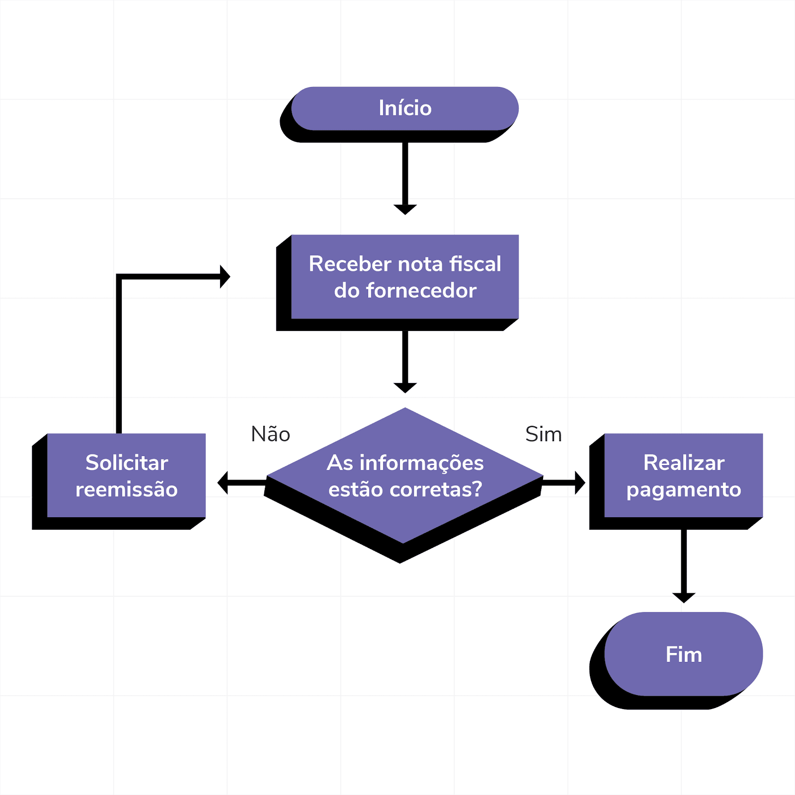
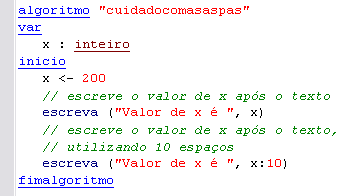
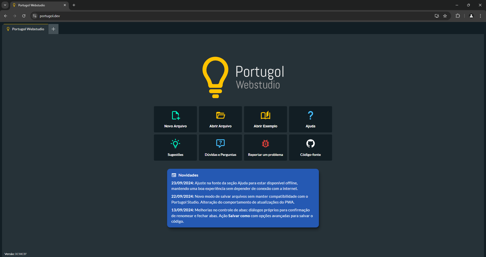

# TPA - Técnicas de programação e algoritmos
### Exemplos práticos de algoritmos, explicações de atividades e de plataformas utilizadas em sala de aula.
>
## Antes de tudo, irei explicar coisas básicas que são fundamentais para o entendimento do material que será compartilhado.
>
### 📌 O que é um algoritmo?
É uma sequência de raciocínios, instruções ou operações para alcançar um objetivo, sendo necessário que os passos sejam  
finitos e operados sistematicamente.
 Simplificando: Algoritmo é o passo a passo de uma atividade que será realizada.
 Exemplo: Chupar uma bala (atividade a ser realizada)
 Inicie procurando um lugar onde venda balas 
 Compre uma bala
 Pague por ela
 Abra a embalagem da mesma
 E depois, você irá chupar ela.
 

## Três tipos de algoritmos mais utilizados: Descrição narrativa, Fluxograma e Pseudocódigo.

### 📌 O que é um fluxograma?
É um diagrama que descreve um processo, sistema ou algoritmo de computador. 
  Tipos de formas:
  
  Exemplo:
  
  
### 📌 O que é pseudocódigo (também conhecido como Linguagem Estruturada ou portugol)?
É uma forma de representar código, sejam algoritmos, funções ou outros processos, usando uma combinação de linguagem 
natural e elementos que se parecem com linguagem de programação. 
  

## Introdução a Linguagem Estruturada (Portugol)

### 📌 O que é Portugol?
Portugol, uma sigla que representa “Pseudo-código em Português”, é uma linguagem de programação didática destinada ao  
aprendizado dos fundamentos da programação. Idealizada para ser uma ferramenta educacional, sua maior vantagem é a  
utilização de uma sintaxe similar ao português, facilitando o entendimento de conceitos complexos de programação  
por iniciantes e estudantes. Em Portugol, as instruções para realizar operações matemáticas, condicionais, loops  
e manipulação de dados são escritas de forma intuitiva, tornando a aprendizagem da lógica de programação mais acessível. 
  
#### (Interface Portugol)

### Link para o acesso ao Portugol
https://portugol.dev/

### Tipos de Dados
#### Inteiro: 
Qaulquer número inteiro, negativo, nulo ou positivo.
exemplo: -15, 0, 101
